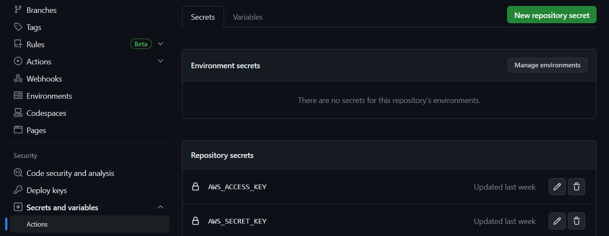

# aws-cdk-template
This is an CDK template repo that can be leveraged to deploy infra to aws.

## Setting up a repo
- Click on the "Use This Template" button and then follow the steps to create a repo in your account
- Add the following GitHub Actions secrets for your repository(Settings > Security > Secrets and Variables > Actions > Secrets)
  - 
- Add the following GitHub Actions secrets for your repository(Settings > Security > Secrets and Variables > Actions > Variables)
  - 
- Add brach protection rules for dev, demo, and prod branches, so that the changes don't get deployed accidentally(Optional)

## Adding resources
- The resources that are to be added should be made available in /cdk-app/cdk_app/cdk_app_stack.py
- It is advised that the resources are defined in their respective modules (Eg. All sqs related resources should be created in /cdk-app/services/sqs_service.py)

## Testing and Deploying
- Any changes pushed to any branch will trigger the test job, Which performs linting and runs tests
- For any changes pushed to "dev" branch, the stack gets deployed to the dev env.
- For any changes pushed to "demo" branch, the stack gets deployed to the staging env.
- For any changes pushed to "prod" branch, the stack gets deployed to the prod env.
- The trigger branch names can be modified in the workflow file(/.github/workflows/deploy-to-aws.yaml)
 
  
